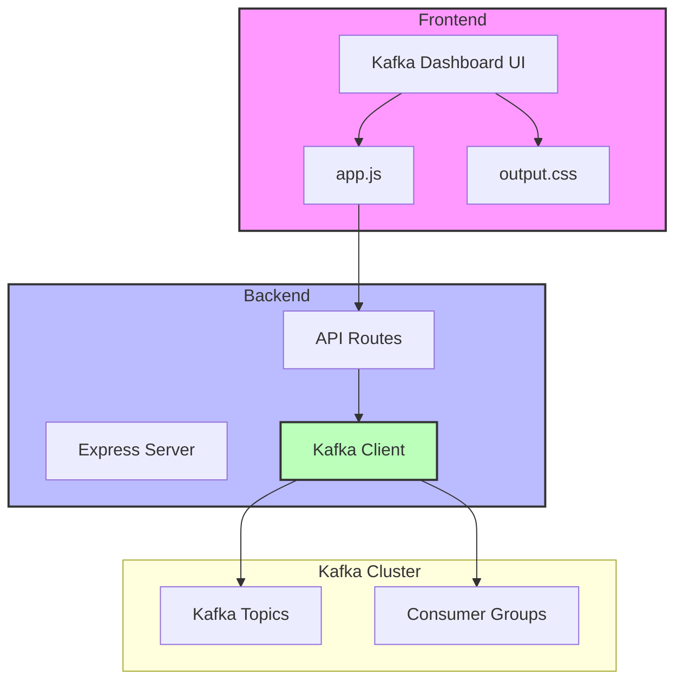

# Kafka Dashboard

A modern, real-time dashboard for monitoring Apache Kafka topics, messages, and consumer groups. Built with Node.js, Express, and Tailwind CSS.

## Features

- 🎨 Modern UI with dark/light theme support
- 🔄 Real-time topic monitoring with auto-refresh
- 📊 Topic details including message depth and partition count
- ➕ **Topic Creation** - Create new topics with configurable partitions and replication
- 📧 Message production with headers support
- 👥 Consumer group monitoring
- 🔍 Message inspection with key-value pairs
- 📖 **Interactive API Documentation** - Swagger/OpenAPI docs at `/api-docs`
- 🎯 Responsive design for all screen sizes
- 🔒 Secure with Content Security Policy (CSP)

## System Architecture



## Prerequisites

- Node.js >= 18.0.0
- Apache Kafka cluster
- npm or yarn package manager

## Installation

1. Clone the repository:
```bash
git clone <repository-url>
cd kafkadash
```

2. Install dependencies:
```bash
npm install
```

3. Create a `.env` file in the root directory:
```env
PORT=4010
KAFKA_BROKERS=localhost:9092
```

## Development

1. Start the development server:
```bash
npm run dev
```

2. Build CSS (in a separate terminal):
```bash
npm run build:css
```

The dashboard will be available at `http://localhost:4010/kafka/dashboard`

## Production Build

1. Build the CSS:
```bash
npm run build
```

2. Start the server:
```bash
npm start
```

## Project Structure

```
kafkadash/
├── src/
│   ├── public/
│   │   ├── css/
│   │   │   ├── styles.css
│   │   │   └── output.css
│   │   ├── js/
│   │   │   └── app.js
│   │   ├── index.html
│   │   └── favicon.ico
│   └── server.js
├── .env
├── .env.example
├── .gitignore
├── package.json
├── tailwind.config.js
└── README.md
```

## API Endpoints

### Topics
- `GET /api/v1/topics` - List all topics with details
- `POST /api/v1/topics` - Create a new topic
- `GET /api/v1/topics/:topic/messages` - Get recent messages for a topic
- `GET /api/v1/topics/:topic/consumers` - Get consumer groups for a topic
- `POST /api/v1/topics/:topic/produce` - Produce a message to a topic

### Cluster
- `GET /api/v1/cluster/health` - Get cluster health status

### Documentation
- `GET /api-docs` - Interactive Swagger/OpenAPI documentation

For detailed API documentation with examples and schemas, visit `/api-docs` when the server is running.

## Security Features

- Content Security Policy (CSP) configured for:
  - Script sources: self, unsafe-inline, cdn.tailwindcss.com, cdnjs.cloudflare.com
  - Style sources: self, unsafe-inline, fonts.googleapis.com, cdnjs.cloudflare.com
  - Font sources: self, fonts.gstatic.com, cdnjs.cloudflare.com
- Proper MIME type handling for static files
- CORS enabled
- Helmet security headers

## Recent Changes

### UI/UX Improvements
- Added dark/light theme toggle
- Implemented auto-refresh functionality
- Added loading states and error handling
- Improved topic card design with hover effects
- Added empty state handling for no topics

### Security Enhancements
- Implemented Content Security Policy
- Added proper MIME type handling
- Configured secure static file serving
- Added error handling middleware

### Performance Optimizations
- Implemented proper caching headers
- Added error recovery for Kafka connection issues
- Optimized static file serving
- Added proper null checks in frontend code

### Bug Fixes
- Fixed CSP violations for external resources
- Resolved MIME type issues for static files
- Fixed path issues for static assets
- Improved error handling for empty topic lists

## Contributing

1. Fork the repository
2. Create your feature branch (`git checkout -b feature/amazing-feature`)
3. Commit your changes (`git commit -m 'Add some amazing feature'`)
4. Push to the branch (`git push origin feature/amazing-feature`)
5. Open a Pull Request

## License

This project is licensed under the MIT License - see the LICENSE file for details. 