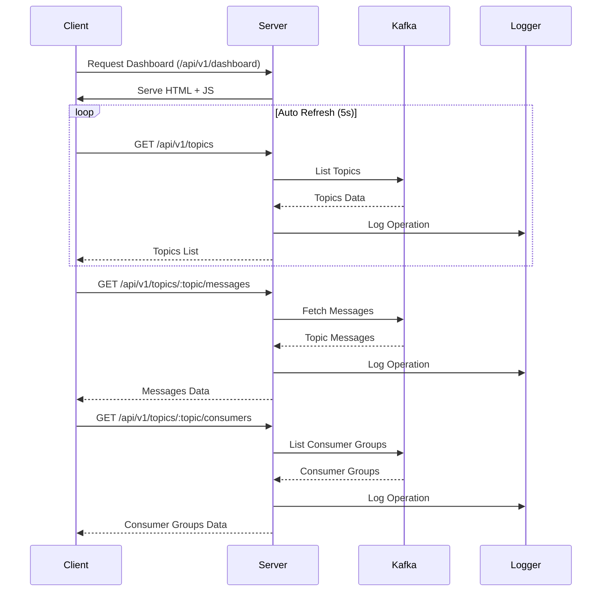

# Kafka Dashboard

A modern, responsive Kafka dashboard built with Node.js and Tailwind CSS.

## Features

- Modern, responsive UI with dark mode support
- Real-time topic monitoring
- Topic details with message preview
- Consumer group information
- Auto-refresh toggle
- Winston logging
- API prefix support

## Project Structure

```
kafkadash/
├── src/
│   ├── public/
│   │   ├── js/
│   │   │   └── app.js          # Frontend JavaScript
│   │   └── index.html          # Main HTML file
│   ├── services/
│   │   └── kafkaService.js     # Kafka operations
│   ├── utils/
│   │   └── logger.js           # Winston logger
│   └── server.js               # Express server
├── .env                        # Environment configuration
├── package.json                # Project dependencies
└── README.md                   # Project documentation
```

## System Flow



## Prerequisites

- Node.js >= 18.0.0
- Kafka cluster running and accessible

## Installation

1. Clone the repository:
```bash
git clone <repository-url>
cd kafkadash
```

2. Install dependencies:
```bash
npm install
```

3. Create a `.env` file in the root directory with the following content:
```
PORT=3000
API_PREFIX=/api/v1
KAFKA_BROKERS=localhost:9092
NODE_ENV=development
```

## Running the Application

Development mode:
```bash
npm run dev
```

Production mode:
```bash
npm start
```

The dashboard will be available at `http://localhost:3000/api/v1/dashboard`

## Available Scripts

- `npm start`: Start the application in production mode
- `npm run dev`: Start the application in development mode with hot reloading
- `npm run check-updates`: Check for package updates
- `npm run lint`: Run ESLint
- `npm test`: Run tests

## API Endpoints

- `GET /api/v1/health`: Health check endpoint
- `GET /api/v1/dashboard`: Main dashboard page
- `GET /api/v1/topics`: List all topics
- `GET /api/v1/topics/:topic/messages`: Get recent messages for a topic
- `GET /api/v1/topics/:topic/consumers`: Get consumer groups for a topic

## Contributing

1. Fork the repository
2. Create your feature branch
3. Commit your changes
4. Push to the branch
5. Create a new Pull Request 